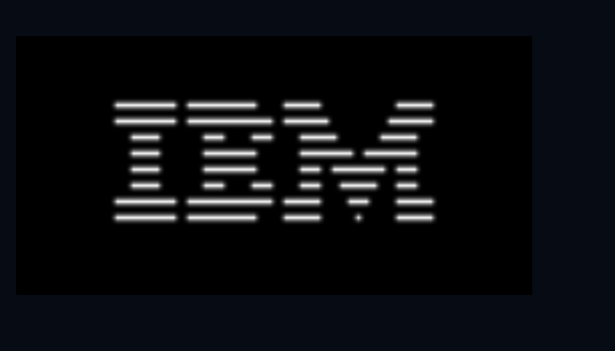

# CHIP-8 Emulator

A CHIP-8 emulator written in C++ using SDL3.

This project emulates the CHIP-8 virtual machine from scratch, implementing its CPU, memory, display, timers, stack, keyboard input, and instruction set. The purpose of this project was to learn emulator development, computer architecture, debugging, and low-level systems programming.

## Features

* Complete CHIP-8 CPU emulation
* Opcode fetch-decode-execute cycle
* Function pointer opcode dispatch tables
* 4KB memory implementation
* 16 general-purpose registers (V0–VF)
* Index register and program counter
* Stack and subroutine support
* Delay and sound timers
* SDL3 graphics rendering
* Keyboard input handling
* ROM loading from file
* Support for standard CHIP-8 ROMs

## Screenshots

### IBM Logo



### Pong


### Tetris


## Controls

| CHIP-8  | Keyboard |
| ------- | -------- |
| 1 2 3 C | 1 2 3 4  |
| 4 5 6 D | Q W E R  |
| 7 8 9 E | A S D F  |
| A 0 B F | Z X C V  |

## Building

### Requirements

* C++17 or newer
* SDL3

### Clone the Repository

```bash
git clone https://github.com/Cozy91/CHIP-8_emulator.git
cd CHIP-8_emulator
```

### Compile

```bash
g++ src/*.cpp -Iinclude $(pkg-config --cflags --libs sdl3) -o chip8
```

## Running

```bash
./chip8 <scale> <cycle_delay> <rom>
```

Example:

```bash
./chip8 10 8 roms/Pong.ch8
```

## CHIP-8 Architecture

| Component     | Value        |
| ------------- | ------------ |
| Memory        | 4096 Bytes   |
| Registers     | 16           |
| Stack Depth   | 16           |
| Display       | 64×32 Pixels |
| Program Start | 0x200        |
| Opcode Size   | 2 Bytes      |

## Tested ROMs

* IBM Logo
* Pong
* Tetris
* Opcode Test ROMs

## What I Learned

Building this emulator helped me gain experience with:

* Emulator architecture
* CPU instruction decoding
* Bitwise operations
* Memory management
* Function pointers
* SDL3 rendering
* Event handling
* Debugging with GDB
* Modern C++ development

## Future Improvements

* Super CHIP-8 support
* Audio support
* Debugger
* Disassembler
* Save states
* Configurable key bindings
* Adjustable emulation speed

## References

* Cowgod's CHIP-8 Technical Reference
* Tobias Langhoff's CHIP-8 Guide
* CHIP-8 Wikipedia Documentation

---

